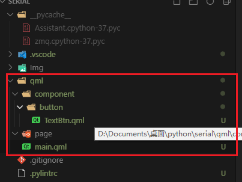

#  Qml 整理

##  编码规范

###  定位

####  相对坐标

####  锚定位

####  Layout

##  Python下使用 Qml

###  简单 Demo

####  Python 文件

```python 
from PySide2.QtWidgets import QApplication
from PySide2.QtQuick import QQuickView
from PySide2.QtCore import QUrl
# from PySide2 import QQmlApplicationEngine 

class Ui (object):
    def __init__(self,qml_url):
        self.app = QApplication([])
        self.view = QQuickView()
        self.url = QUrl(qml_url)
        self.view.setSource(self.url)

    def run(self) :
        self.view.show()
        self.app.exec_()


if __name__ == '__main__':
    ui = Ui("Qml/main.qml")
    ui.run()
```

####  Qml 文件

```javascript
import QtQuick 2.6
import QtQuick.Controls 1.4
import QtQuick.Window 2.2

Rectangle {
    width: 800
    height: 800
    id: window1
    
    Rectangle {
        width: 50
        height: 50
        color: "red"
    }
    
    Text {
        text: "hello world"
        color: "black"
        font: 40
    }
}
```

####  .pylintrc 文件

```
extension-pkg-whitelist=PySide2
```

##  组件化编程

###  C++ 目录

###  导入其他目录下 Qml 文件

> 注意事项：除了 **main.qml** 文件之外的其他 **qml** 文件命名时首字母大写。

* 文件目录
  * **component** 存放功能模块。如：**button**。
  * **page** 存放各个图层的具体实现。
  * **test** 存放测试文件目录。
  * **main.qml** 初始调用文件。
  * **Img** 文件夹为图片 **UI** 存放位置。



* 代码调用

```javascript
import "./component/button" as QBTN  

// 使用 QBIN 
QBTN.TextBtn {
    id: button_1
    x: 200
    y: 200 
    height: 200
    width: 200
    text: "is a button text"
    textColor: "#171717"
}
```

