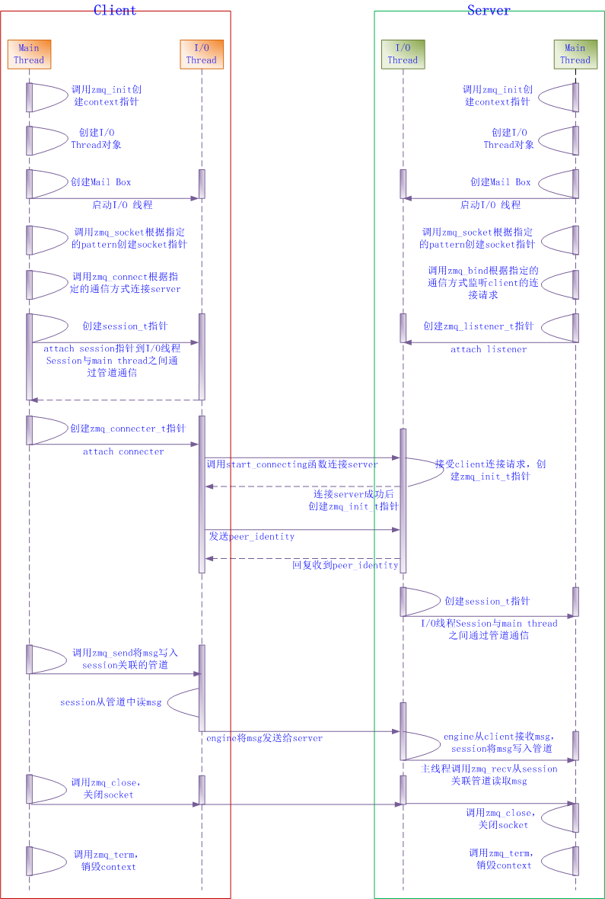
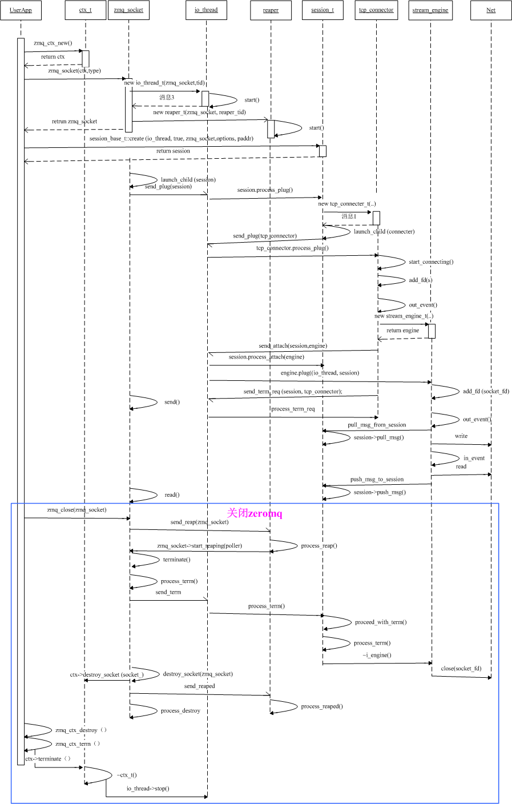

# zeromq 源码笔记

[TOC]

##  资料整理

### zeromq 简介

> ZMQ（ØMQ、ZeroMQ, 0MQ）看起来像是一套嵌入式的网络链接库，但工作起来更像是一个并发式的框架。它提供的套接字可以在多种协议中传输消息，如线程间、进程间、TCP、广播等。你可以使用套接字构建多对多的连接模式，如扇出、发布-订阅、任务分发、请求-应答等。ZMQ 的快速足以胜任集群应用产品。它的异步 I/O 机制让你能够构建多核应用程序，完成异步消息处理任务。ZMQ有着多语言支持，并能在几乎所有的操作系统上运行。ZMQ 是 [iMatix](http://www.imatix.com/) 公司的产品，以LGPL 开源协议发布。

* 官网 ：https://zeromq.org/
* GitHub 指南 ：https://github.com/anjuke/zguide-cn/blob/master/chapter3.md
* Blog ：https://www.cnblogs.com/zengzy/category/777608.html

##  使用指南

TODO：待整理

##  源码分析

### 环境

* IDE  :  Visual Studio 2019
* 仓库 
  * libzmq ：https://github.com/zeromq/libzmq
  * 对应于 libzmq 的 C++ 封装  cppzmq ：https://github.com/zeromq/cppzmq  

###  应用场景

​	TODO ：待整理

###  软件架构设计

zeromq 中 几乎所有 I/O 操作为异步操作。

#### 整体设计

#### [内部设计](https://www.cnblogs.com/hummersofdie/p/4597031.html)

资料：http://wiki.zeromq.org/whitepapers:architecture

##### 全局状态

全局变量不适合在库中使用，两个实例访问一个变量，会造成冲突和竞争。在 zmq 中未使用全局变量，由使用者进行控制，全局变量状态为 `context` 。多个状态之间相互隔离，不会造成影响。

==注意：绝不要在库中使用全局变量==

#####  性能

* 吞吐量：（ 端点上指标 ）
* 时延

==注意：确保理解你正在解决的问题。即使是一个“让它更快”这样简单的问题也会耗费你大量的工作才能正确理解之。更何况如果你不理解问题，你很可能会隐式地将假设和某种流行的观点置入代码中，这使得解决方案要么是有缺陷的或者至少会变得非常复杂，又或者会使得该方案没有达到它应有的适用范围。==

##### 关键路径

* 内存分配的次数
* 系统调用的次数
* 并发模型

==注意：只在对结果能产生影响的地方做优化。优化非关键路径上的代码只是在做无用功。==

##### 内存分配

> 零拷贝：为消息体分配一次内存，传递指向分配内存块的指针，不是拷贝数据。

* 小消息，内容存放在句柄中，对句柄拷贝从而进行数据拷贝
* 大消息，采用零拷贝，缓存区采用引用计数，多个句柄引用不必拷贝数据。

注意：考虑性能问题时，不要假设存在一个最佳解决方案，可以将问题分解，然后优化子问题。

##### 批量处理

问题：系统调用数量太多导致性能瓶颈。

>  ØMQ 尝试采用以下策略来提供一致性的低时延和高吞吐量。当消息流比较稀疏，不超过网络协议栈的带宽时，ØMQ 关闭所有的批量处理以改善时延。

##### 并发模型

##### 无锁算法

原子操作

##### API

##### 消息模式

* REP - REQ
* 待整理...

#### zmq 基本流程

#### zmq 对象交互

