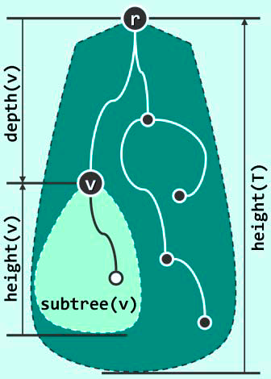

#  数据结构

##  二叉树

* 树为半线性结构。

### 二叉树及其表示

####  树

> 树等价于连通无环图。

> 由顶点（vertex），若干条边（edge）组成。指定某一特定顶点，并称之为根（root）。在指定根节点之后，我们也称之为有根树（rooted tree）。此时，从程序实现的角度，我们也更多地将顶点称作节点（node）。

#### 二叉树

* 数据结构
##### 

####  多叉树

