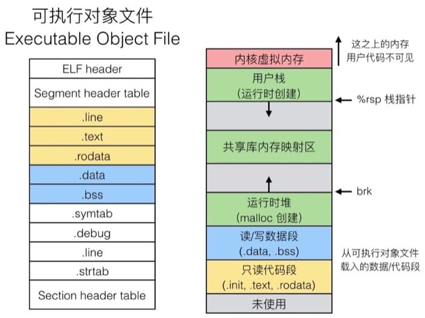

#  深入理解计算机系统

##  数据格式

下图表示 **0x01234567** 在内存的分布

| 内存地址 | 0x100 | 0x101 | 0x102 | 0x103 |
| :------: | :---: | :---: | :---: | :---: |
| 大端格式 |  01   |  23   |  45   |  67   |
| 小端格式 |  67   |  45   |  23   |  01   |

##  位运算

###  实现异或运算

```c++
// 只用 & 和 ~ 实现 x^y
// 1 ^ 1 = 0 、1 ^ 0 = 1 、0 ^ 1 = 1、0 ^ 0 = 0
template <class T>
T bitXor(T x, T y)
{
	T a = ((~x) & y);
	T b = (x & (~y));
	//包含 | 运算符
	//~(~x & ~y);
	//return (~x & y) | (x & ~y);
	return ~((~a) & (~b));
}

// bitXor 测试程序
bool bitXor_test()
{
	if (bitXor<Byte>(0, 1) != (0 ^ 1))
		return false;
	if (bitXor<Byte>(1, 0) != (1 ^ 0))
		return false;
	if (bitXor<Byte>(1, 1) != (1 ^ 1))
		return false;
	if (bitXor<Byte>(0, 0) != (0 ^ 0))
		return false;
	return true;
}
```

###  实现所有奇数位是否为1

```c++
template <class T>
bool allOddBits(T x)
{
	int len = sizeof(T) * 8;
	int tmp = 0x02;
	for (int i = 1; i < len; i += 2)
	{
		if ((tmp & x) != tmp)
			return false;
		tmp = tmp << 2;
	}
	return true;
}

// 测试代码 allOddBits
void test_allOddBits()
{
	if (allOddBits<int>(0xAAAAAAAA) == true)
		std::cout << "test_allOddBits 1 is " << "true" << std::endl;
	if (allOddBits<int>(0xFFFFFFDF) == false)
		std::cout << "test_allOddBits 2 is " << "false" << std::endl;
}
```
###  判断是不是  Ascii  数字
```c++
int isAsciiDigit(Byte x) 
{
	switch (x)
	{
	case 0x30:
	case 0x31:
	case 0x32:
	case 0x33:
	case 0x34:
	case 0x35:
	case 0x36:
	case 0x37:
	case 0x38:
	case 0x39:
		return 1;
		break;
	default:
		return 0;
		break;
	}	
}

void test_isAsciiDigit()
{
	char ch = '1';
	if ( isAsciiDigit(ch) == 1 )
	{
		std::cout << "isAsciiDigit" << " is " << "OK" << std::endl;
	}
}
```

##  机器指令与程序优化

###  从 C 到 机器代码

```MERMAID
graph LR
A[预处理器] --> B[编译器] 
	B --> C[汇编器]
	C --> D[链接器]
	D --> E[可执行程序]
```

####  预处理器

 将 C 语言代码转化成 `da.i` 文件(`gcc –E`)，对应于预处理命令 `cpp` 

- 宏定义指令
- 条件编译指令
- 头文件包含指令
- 特殊符号

头文件

- 从 `-I` 开始寻找。
- 环境变量寻找。
- 默认目录。

####  编译、优化

通过词法分析和语法分析，在确认所有的指令都符合语法规则之后，将其翻译成等价的中间代码表示或汇编代码。

* 代码段
* 数据段

####  链接器

1. 符号解析 **Symbol resolution**

2. 重定位 **Relocation**

文件列表：

- 可重定位目标文件   Relocatable object file (`.o` file )
- 可执行目标文件 Executable object file (`a.out` 、`a.exe`  file ) 
- 共享目标文件 shared object file ( `.so`  file )
  - Window 下为 Dynamic Link Libraries ( `DLLs` )
  - 静态库文件

文件格式：==**ELF**== (  Executable and Linkable Format  )


####  链接过程

1. 符号解析
   * 局部非静态变量保存到 栈 中
   * 局部静态变量保存在 `.bss` 或者 `.data` 中
   * 同名静态变量 **符号表**
   * 同名的全局变量（ 强符号：函数和初始化全局变量，弱符号：为初始化全局变量）
     *  不能出现多个同名的强符号，不然就会出现链接错误 。
     *  如果有同名的强符号和弱符号，选择强符号，也就意味着弱符号是无效。
     *  如果有多个弱符号，随便选择一个 。
     * 使用全局变量的建议
       * 使用静态变量
       * 定义全局变量的时候初始化
       * 注意使用 `extern` 关键字
   
2. 重定位 Relocation

   ​	把不同可重定位对象文件拼成可执行对象文件。

   	下图为程序在内存中的分布，左侧地址从上往下（上面地址较小），右侧则是从下往上（下面地址较小）

 

####  打包常用程序
- 静态库

  ​	

- 共享库


### 汇编

 

